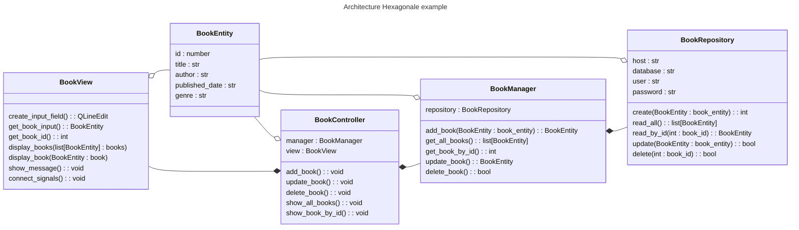

```mermaid
---
title: Architecture Hexagonale example
---
classDiagram
    direction LR
    BookView  o-- BookEntity

    BookEntity --o BookController

    BookEntity --o BookManager

    BookEntity --o BookRepository
    BookView --* BookController
    BookController *-- BookManager
    BookManager *-- BookRepository

    class BookView {
    create_input_field() : QLineEdit
    get_book_input() : BookEntity
    get_book_id() : int
    display_books(list[BookEntity] : books)
    display_book(BookEntity : book)
    show_message() : void
    connect_signals() : void
    }

    class BookController {
    manager : BookManager
    view : BookView
    add_book() : void
    update_book() : void
    delete_book() : void
    show_all_books() : void
    show_book_by_id() : void
    }

    class BookManager {
    repository : BookRepository
    add_book(BookEntity : book_entity) : BookEntity
    get_all_books() : list[BookEntity]
    get_book_by_id() : int
    update_book() : BookEntity
    delete_book() : bool
    }

    class BookRepository {
    host : str
    database : str
    user : str
    password : str
    create(BookEntity : book_entity) : int
    read_all() : list[BookEntity]
    read_by_id(int : book_id) : BookEntity
    update(BookEntity : book_entity) : bool
    delete(int : book_id) : bool
    }

    class BookEntity {
    id : number
    title : str
    author : str
    published_date : str
    genre : str
    }
```
